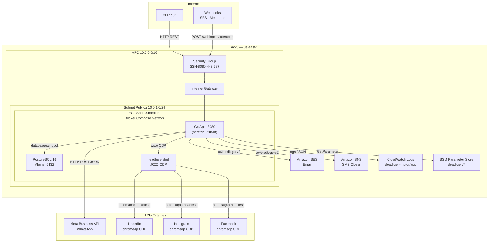

# Lead Gen Motor

> **Motor de Prospecção Omnichannel** — Engine de automação B2B construída em Go com arquitetura hexagonal, rate limiting por token bucket e infraestrutura AWS provisionada via Terraform. Seis canais de comunicação num binário de 20 MB.

---

```
┌─────────────────────────────────────────────────────────────────────────┐
│                         LEAD GEN MOTOR v1.0                             │
│                                                                         │
│   Go 1.22  ·  PostgreSQL 16  ·  Docker  ·  Terraform  ·  AWS Academy   │
│                                                                         │
│   6 canais · 5 workers · token bucket rate limiting · ~$14/mês         │
└─────────────────────────────────────────────────────────────────────────┘
```

## Índice

- [O Que É Isso](#o-que-é-isso)
- [Início Rápido](#início-rápido)
- [Arquitetura em Diagrama](#arquitetura-em-diagrama)
- [Stack](#stack)
- [Canais Suportados](#canais-suportados)
- [API — Referência Rápida](#api--referência-rápida)
- [Infraestrutura AWS](#infraestrutura-aws)
- [Desenvolvimento Local](#desenvolvimento-local)
- [Documentação Completa](#documentação-completa)

---

## O Que É Isso

O Lead Gen Motor automatiza o ciclo de prospecção B2B: você cadastra leads, cria campanhas com templates variáveis e o motor envia mensagens pelos canais configurados, respeita rate limits de cada plataforma, pontua leads por engajamento e notifica o vendedor quando um lead está pronto para fechar.

O que o diferencia de ferramentas como Instantly.ai ou Lemlist: roda na sua própria AWS com custo de $14/mês, o código é seu, e a arquitetura hexagonal torna cada canal trocável sem tocar no core.

---

## Início Rápido

### AWS (deploy completo em ~10 minutos)

```bash
# Configure credenciais AWS Academy
export AWS_ACCESS_KEY_ID=ASIA...
export AWS_SECRET_ACCESS_KEY=...
export AWS_SESSION_TOKEN=...
export TF_VAR_db_senha="senha_forte_aqui"

# Um comando para tudo: Terraform + EC2 + Docker Compose
./scripts/deploy.sh
```

**Resultado:**
```
[OK] Infraestrutura provisionada — IP: 54.123.x.x
[OK] Docker pronto na instância
[OK] Aplicação respondendo

  API:    http://54.123.x.x:8080/api/v1
  Health: http://54.123.x.x:8080/api/v1/health
  SSH:    ssh -i terraform/lead-gen-key ec2-user@54.123.x.x
```

### Desligar (preserva créditos AWS)

```bash
./scripts/destroy.sh   # faz backup automático do banco antes de destruir
```

### Local (desenvolvimento)

```bash
cd app
cp .env.example .env   # edite: DB_SENHA=dev123
docker-compose up -d   # PostgreSQL + Chrome headless
go run ./cmd/server/   # API em :8080
```

---

## Arquitetura em Diagrama



---

## Stack

| Camada | Tecnologia | Versão | Função |
|---|---|---|---|
| Linguagem | Go | 1.22 | Backend + engine |
| Banco | PostgreSQL Alpine | 16 | Persistência de leads e jobs |
| Rate Limiting | golang.org/x/time/rate | latest | Token bucket por canal |
| Email | AWS SDK v2 + SES | v1.27 | Envio transacional |
| SMS | AWS SDK v2 + SNS | v1.29 | Notificação do closer |
| Social | chromedp | v0.9.5 | Automação LinkedIn/Instagram/FB |
| IaC | Terraform | >= 1.5 | EC2 Spot, VPC, IAM, CloudWatch |
| Runtime | Docker + Compose | latest | Orquestração local e produção |
| HTTP | net/http stdlib | Go 1.22 | Roteamento com `{id}` patterns |
| Logging | log/slog stdlib | Go 1.21+ | JSON estruturado → CloudWatch |

---

## Canais Suportados

| Canal | Adapter | Limite/hora | Limite/dia | Burst |
|---|---|---|---|---|
| Email | `adapters/email/ses.go` | 50 | 200 | 5 |
| WhatsApp | `adapters/whatsapp/webhook.go` | 10 | 50 | 2 |
| LinkedIn | `adapters/social/chromedp.go` | 5 | 20 | 1 |
| Instagram | `adapters/social/chromedp.go` | 5 | 20 | 1 |
| Facebook | `adapters/social/chromedp.go` | 5 | 20 | 1 |
| SMS (closer) | `adapters/sms/sns.go` | 20 | 100 | 3 |

Cada adapter implementa a interface `ports.MessengerPort`. Adicionar um canal novo = criar 1 arquivo + 4 edições pontuais. Ver [DOCUMENTATION.md](DOCUMENTATION.md#7-detalhamento-técnico-infraestrutura-iaC) para o guia passo a passo.

---

## API — Referência Rápida

```bash
BASE="http://localhost:8080/api/v1"

# Sistema
curl $BASE/health
curl $BASE/status                    # workers, fila, ocupação

# Leads
curl -X POST $BASE/leads \
  -H "Content-Type: application/json" \
  -d '{"nome":"João Silva","email":"joao@acme.com","empresa":"Acme","cargo":"CTO"}'

curl "$BASE/leads?nome=João&limite=10"
curl $BASE/leads/{uuid}
curl -X PUT $BASE/leads/{uuid} -d '{"status":"convertido"}'

# Campanhas
curl -X POST $BASE/campanhas \
  -d '{"nome":"Q1 B2B","canais":["email","linkedin"],
       "template_assunto":"Parceria {{empresa}}",
       "template_corpo":"Olá {{nome}}, ..."}'

curl -X PUT $BASE/campanhas/{uuid}/ativar
curl -X PUT $BASE/campanhas/{uuid}/pausar

curl -X POST $BASE/campanhas/{uuid}/despachar \
  -d '{"leads_ids":["uuid1","uuid2"],"canal":"email"}'

# Webhook de engajamento
curl -X POST $BASE/webhooks/interacao \
  -d '{"lead_id":"uuid","tipo":"respondeu_email","canal":"email"}'
```

---

## Infraestrutura AWS

| Recurso | Tipo | Custo/mês |
|---|---|---|
| EC2 Spot t3.medium | Compute | ~$11.52 |
| EBS gp3 20GB encrypted | Storage | $1.60 |
| CloudWatch Logs (7 dias) | Observability | ~$0.50 |
| Data Transfer | Egress | ~$0.50 |
| **Total estimado** | | **~$14-16** |

```bash
# Gerenciar a infra
cd terraform
terraform init && terraform plan    # ver o que será criado
terraform apply                     # provisiona tudo
terraform destroy                   # destrói tudo (scripts/destroy.sh faz backup antes)
```

---

## Desenvolvimento Local

```bash
# Setup único
cd app && cp .env.example .env

# Sobe dependências
docker-compose up -d postgres chromedp

# Roda a aplicação com hot-reload manual
go run ./cmd/server/

# Testa
go test ./...
curl http://localhost:8080/api/v1/health

# Build da imagem (verifica < 50MB)
docker build -t lead-gen-motor:latest .
docker images lead-gen-motor   # ~20MB esperado
```

---

## Documentação Completa

Para análise técnica exaustiva — decisões arquiteturais, fluxo de dados, Go concurrency, Terraform state, modelagem do banco, estimativa de custos e backlog técnico:

**[DOCUMENTATION.md](DOCUMENTATION.md)**

| Seção | Conteúdo |
|---|---|
| [2. Introdução](#) | Visão do projeto e contexto do problema |
| [3. Escopo](#) | O que está dentro e fora da solução |
| [4. Stack e Vantagens](#) | Por que Go, por que cada ferramenta |
| [5. Arquitetura](#) | Hexagonal, camadas, fluxo de dados completo |
| [6. Backend Go](#) | Goroutines, interfaces, error handling, rotas |
| [7. Infraestrutura IaC](#) | Terraform providers, módulos, estado |
| [8. Guia Docker & Local](#) | Passo a passo para rodar |
| [9. Requisitos e Qualidade](#) | RF, RNF, testes |
| [10. Operacional e Custos](#) | Banco de dados, estimativas AWS |
| [11. Encerramento](#) | Artefatos, desafios, backlog técnico |

---

> Projeto desenvolvido por **Demarchi MEI** · Go + AWS Academy (FIAP)
